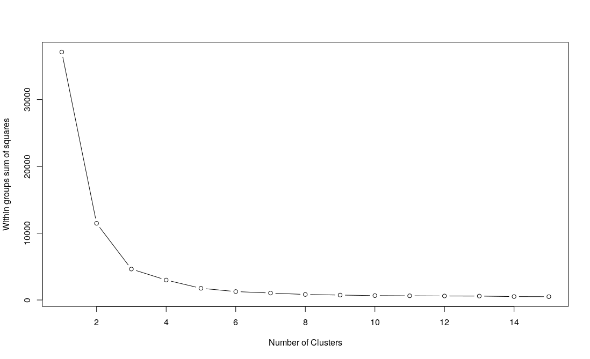
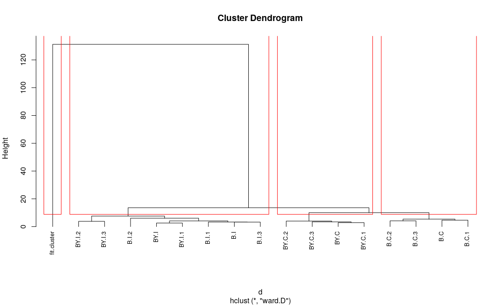

## Clustering de datos de microarreglos

**Biól. Diego Montesinos Valencia, 2020**

### Introducción 

El análisis de agrupamiento o clustering es una técnica estadística que permite dilucidar distintos patrones en los datos de expresión génica y puede utilizarse en datos de microarreglos para agrupar genes (Srivastava & Joshi, 2014). 

Algunos autores consideran que los datos de expresión génica necesitan ser agrupados tanto por genes como por muestras (Srivastava & Joshi, 2014). La agrupación basada en genes se puede aplicar en el conjunto de datos filtrados donde las muestras ya están clasificadas, de manera general se puede realizar clustering basándose en diferentes métodos, los cuales van desde agrupamiento jerárquico, algoritmos de particionamiento, agrupamiento basado en densidad, agrupamiento basado en restricciones, agrupamiento evolutivo y algoritmos basados  en particiones de gráficos (Srivastava & Joshi, 2014).

La utilidad del clustering radica en que se obtiene un gráfico donde se muestran los genes coexpresados en un mismo grupo, esto podría indicar una relación entre los patrones de expresión de  los grupos de genes y los procesos celulares en que estén involucrados dichos genes (corregulación) (Daxin, Chun & Aidong, 2004).

### **Objetivo**

- Utilizando un pequeño grupo de datos de microarreglos de los perfiles de expresión génica del tejido cardíaco de los ratones machos (realizado en la plataforma Illumina Mouse-Ref8) (Llamas et al., 2009), realizar el clustering de dichos datos a partir de una matriz de datos normalizados.

### **Metodología**

Ver el siguiente enlace “README”

### **Resultados y discusión**

El método de clustering K-means es una forma de particionar un grupo de datos donde es necesario determinar el número de grupos o “clusters” que se desea extraer, para esto se necesita realizar una gráfica de suma de cuadrados con el fin de encontrar una curva en la gráfica similar a una prueba de evaluación en el análisis factorial. Para este caso el gráfico de suma de cuadrados para las muestras utilizadas (Fig. 1) muestra un punto de inflexión entre 4 y 5, por lo que se optó por utilizar el número 4 como el valor “K-means”.

                                         

​                                                         Fig. 1. Gráfico de suma de cuadrados.

Cuando se realizó el análisis de clusters de los genes con K=4 y se obtuvo el gráfico de clusters (Fig. 2), en este gráfico se observan 4 clusters los cuales parecen no superponerse por completo pero tienen regiones donde hay cierto grado se superposición (particularmente entre los clusters 1-3 y 3-4). El cluster 2 es el único que tiene un mayor grado de dispersión de sus datos y no se superpone con ninguno de los otros clusters, por otro lado, parece haber una mayor densidad de genes que se superponen entre los cluster 1 y 3. Sin embargo todos los genes parecen estar medianamente bien representados en estos 4 clusters.

​                                                           Fig. 2. Gráfico de clusters con K=4.

Al realizar el clustering jerárquico se obtuvo el dendrograma de clusters (Fig. 3), el cual muestra nuevamente los 4 clusters (recuadros rojo) pero con la nomenclatura utilizada durante el diseño experimental. El dendrograma agrupa en un solo cluster a todos los genes de los individuos intactos (sin tratamiento), tanto de los individuos de la cepa denominada "B" (B.I en este caso) y los de la cepa "BY" (BY.I para este caso). Por otro lado, a los genes de los individuos castrados los divide en dos clusters de acuerdo al tipo de cepa, es decir, un cluster para "BY" ("BY.C") y otro cluster para "B" ("B.C".  

​                                                                 Fig. 3. Dendrograma de clusters con K=4.

### Conclusiones

Utilizando la matriz normalizada de un pequeño grupo de datos de microarreglos de los perfiles de expresión génica del tejido cardíaco de los ratones machos (Llamas et al., 2009), se obtuvo un set de genes DE que al parecer están bien representados por al menos 4 clusters ya que dichos clusters no se superponen por completo y mantienen cierta relación entre ellos.
Al realizar el análisis jerárquico es posible observar que los genes DE obtenidos por Llamas et. al. (2009), parecen estar restringidos a ciertos clusters. Algunos genes están restringidos a los individuos sin tratamiento (o intactos) tanto de de la cepa C57BL / 6J como de la cepa C57BL / 6J-chrY (denominadas en este ensayo como "B" y "BY" respetivamente). No obstante, parece haber diferencias en los individuos castrados ya que los genes DE obtenidos se dividen en dos cluster aparte, unos para los individuos de la cepa  C57BL / 6J y otros para los individus de la cepa C57BL / 6J-chrY.

En conclusión, parece ser que el tratamiento de castración influye en los genes DE en las dos cepas de ratón ("C57BL / 6J" y "C57BL / 6J-chrY").

#### Bibliografía

- Daxin, J., Chun T. & Aidong Z. (2004). Cluster analysis for gene expression data: a survey. IEEE Transactions on Knowledge and Data Engineering, 16, 1370–1386 pp. doi:10.1109/tkde.2004.68.

- Srivastava, S. & Joshi, N. (2014). Clustering Techniques Analysis for Mcroarray Data. IJCSMC, 3, 359-364 pp.